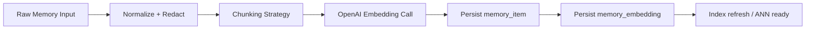
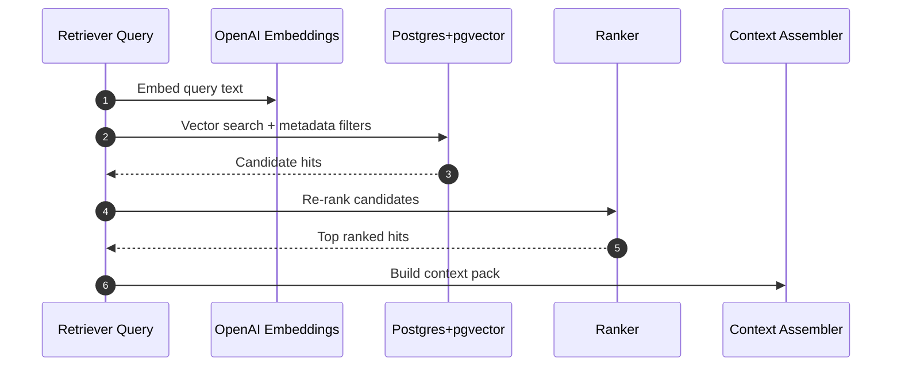
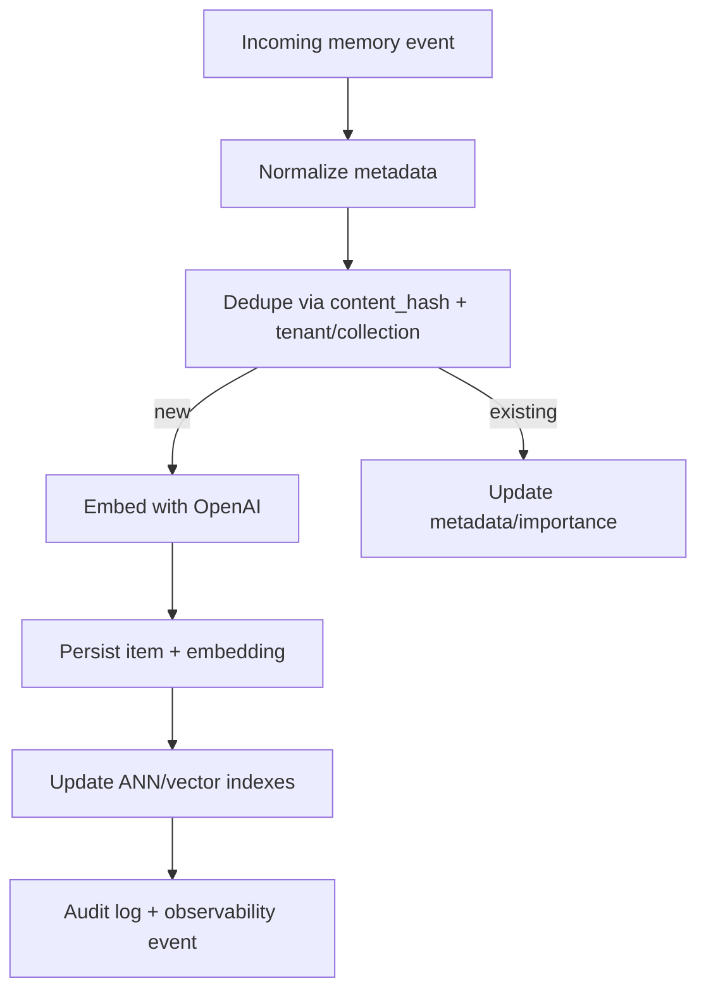

# TaskFlow AI - AI Memory Architecture (PostgreSQL + pgvector + Prisma)

This document defines a production-grade memory architecture for TaskFlow AI supporting:

- semantic memory
- decision memory
- preference memory
- workspace isolation
- vector embeddings
- retrieval ranking
- memory compression
- metadata filtering
- long-term persistence

Tech stack:

- PostgreSQL
- pgvector
- Prisma
- OpenAI embeddings

---

## 1) Memory Domains

TaskFlow AI uses 3 memory domains with different retrieval semantics.

### 1.1 Semantic Memory

Purpose:

- store factual/contextual knowledge chunks (tasks, docs, standup summaries, risks)
- support RAG for assistants/workflows

Characteristics:

- embedding-first retrieval
- optional recency and source-quality boosts
- metadata-heavy filtering

### 1.2 Decision Memory

Purpose:

- capture why decisions were made (e.g., sprint allocation rationale, escalation decisions)
- improve explainability and consistency

Characteristics:

- hybrid retrieval: semantic + structured filtering by decision type/outcome
- stronger provenance requirements

### 1.3 Preference Memory

Purpose:

- persist stable user/team/workspace preferences (communication style, prioritization style, capacity assumptions)

Characteristics:

- direct-key retrieval first
- semantic fallback when preference key is unknown
- high weight in context assembly for personalization

---

## 2) Schema Design (Prisma + PostgreSQL)

The existing schema already provides:

- `memory_collection`
- `memory_item`
- `memory_embedding`

To support production behavior for all three memory domains, add explicit domain metadata + indexing fields.

## 2.1 Core model extensions (recommended)

### `memory_collection`

Add:

- `memory_domain` enum: `SEMANTIC | DECISION | PREFERENCE`
- `retention_policy_key` (e.g. `semantic_180d`, `decision_forever`, `preference_sticky`)

### `memory_item`

Add:

- `source_type` (`TASK`, `STANDUP`, `WORKFLOW_EVENT`, `USER_NOTE`, etc.)
- `source_id` (for provenance and back-references)
- `importance_score` (`0..1`) default `0.5`
- `freshness_expires_at` (optional)
- `is_compressed` boolean
- `compression_parent_item_id` (for summary lineage)
- `decision_type` / `decision_outcome` (nullable; decision memory only)
- `preference_key` / `preference_scope` (`USER`, `TEAM`, `WORKSPACE`) (nullable; preference memory only)

### `memory_embedding`

Add:

- `embedding_model_key` (required in practice)
- `embedding_dimension` int (safety check)
- `embedding_version` (to support re-embedding migrations)
- optional `quantized` flag for future compression

## 2.2 Suggested Prisma enums (design)

- `MemoryDomainType`: `SEMANTIC`, `DECISION`, `PREFERENCE`
- `PreferenceScope`: `USER`, `TEAM`, `WORKSPACE`
- `SourceType`: `TASK`, `SPRINT`, `MEETING`, `WORKFLOW`, `RISK`, `SYSTEM`, `OTHER`

## 2.3 Constraints and indexes

Always include tenant/workspace in every index path:

- `(tenant_id, namespace_type, namespace_key, created_at desc)`
- `(tenant_id, memory_domain, source_type, created_at desc)`
- `(tenant_id, preference_key, preference_scope)` for preference lookup
- unique `(tenant_id, collection_id, content_hash)` remains valid

For ANN/vector:

- pgvector HNSW index per embedding model/dimension strategy
- separate index sets if multiple embedding dimensions are live

---

## 3) Embedding Pipeline (OpenAI)

## 3.1 Ingestion stages

### Stage details

1. Normalize + Redact

- remove secrets/PII where not required
- attach structured metadata (`source_type`, `source_id`, domain fields)

2. Chunking

- semantic/doc chunks: token-window chunking with overlap
- decision entries: usually one item per decision record
- preferences: one item per preference key/value with concise canonical text

3. Embedding

- use OpenAI embedding model (single canonical model initially)
- include `embedding_model_key` and `embedding_dimension`

4. Persist

- write `memory_item` and related `memory_embedding` in one transaction
- emit audit event `MEMORY_UPSERTED`

---

## 4) Retrieval Architecture

## 4.1 Query flow

## 4.2 Metadata filtering

Required filters:

- `tenant_id`
- workspace namespace (`namespace_type`, `namespace_key`)

Optional filters:

- `memory_domain`
- `source_type`
- `preference_scope` / `preference_key`
- recency window
- `importance_score` threshold

## 4.3 Retrieval modes

- Semantic mode:
  - vector similarity + freshness + importance boosts
- Decision mode:
  - vector similarity + decision_type/outcome filter + provenance boost
- Preference mode:
  - direct key lookup first, fallback to vector search

---

## 5) Ranking Strategy

Use a weighted score for final ranking:

`final_score = 0.55 * vector_similarity + 0.20 * recency + 0.15 * importance + 0.10 * provenance_quality`

Where:

- `vector_similarity`: pgvector cosine similarity normalized to `[0,1]`
- `recency`: decay function based on `created_at` or `freshness_expires_at`
- `importance`: explicit score set during ingestion or later feedback
- `provenance_quality`: trusted source weighting (`WORKFLOW` > `USER_NOTE` > `OTHER`, configurable)

Domain overrides:

- Preference memory:
  - boost exact `preference_key` matches above vector score
- Decision memory:
  - boost same `decision_type` and recent successful outcomes

---

## 6) Memory Indexing Flow

Key behaviors:

- idempotent ingestion by `content_hash`
- re-embedding pipeline for model upgrades
- async indexing acceptable if retrieval layer handles warm-up state

---

## 7) Context Assembly Pipeline

The retriever returns ranked hits; context assembly builds LLM-ready context.

## 7.1 Assembly steps

1. fetch top candidates by domain
2. apply token budget policy:
   - reserve fixed budget for preferences + decisions
   - allocate remainder to semantic context
3. deduplicate near-duplicate chunks
4. preserve explainability:
   - include references (`memory_item.id`, `source_type`, `source_id`)
5. emit context artifact:
   - `context_sections[]` with `domain`, `summary`, `references`

## 7.2 Suggested section order

- preferences first (behavioral constraints)
- decisions second (why/consistency)
- semantic facts third (situational context)

---

## 8) Memory Compression Strategy

Compression addresses long-term scale while preserving useful signal.

## 8.1 Types

- temporal compression:
  - summarize old semantic chunks into period summaries
- decision compression:
  - keep canonical decisions, compress intermediate deliberation
- preference compression:
  - keep latest effective value + history pointer

## 8.2 Lineage model

- compressed item references original item IDs
- original items can be soft-archived, not hard-deleted immediately
- retrieval can choose compressed/uncompressed based on query depth

---

## 9) Lifecycle Management

## 9.1 Retention policies

By domain:

- semantic: TTL-based with periodic compression
- decision: long retention (compliance/audit)
- preference: keep active value indefinitely; archive stale history

## 9.2 Background jobs

Required jobs:

- embedding backfill/re-embed
- stale semantic compression
- soft-delete + archival by retention policy
- index maintenance and vacuum/analyze scheduling

## 9.3 Consistency and durability

- ingestion transaction includes `memory_item` + `memory_embedding`
- audit logs append for ingestion/compression/deletion events
- outbox pattern recommended for async downstream indexing notifications

---

## 10) Observability and Quality

Track:

- embedding latency/cost by model key
- retrieval latency and hit count
- top-k relevance acceptance (via human/implicit feedback)
- compression ratio and recall impact
- per-tenant storage growth

Operational SLO suggestions:

- p95 retrieval latency < 200ms (excluding embedding call if cached)
- failed embedding jobs < 1%
- re-embed backlog < 24h

---

## 11) Prisma Implementation Guidance (next step)

1. Add enums + domain fields to memory tables in `packages/database/prisma/schema.prisma`
2. Generate migration for:
   - new columns
   - indexes
   - pgvector ANN indexes (SQL migration step)
3. Add repository interfaces in `packages/database` for:
   - ingest
   - search
   - compress
   - lifecycle jobs

This keeps architecture aligned with current TaskFlow AI data model while adding production memory capabilities.
