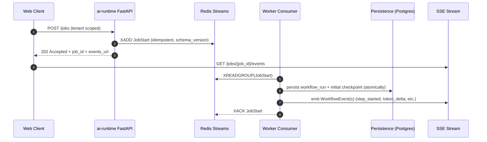
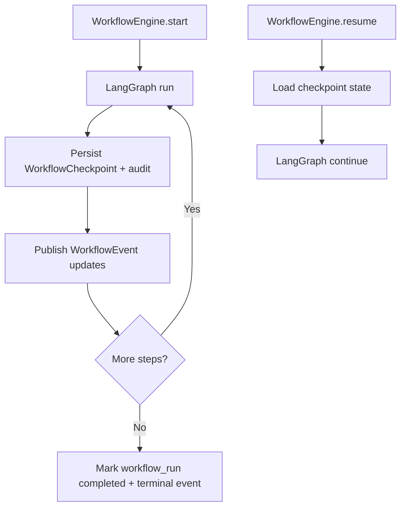
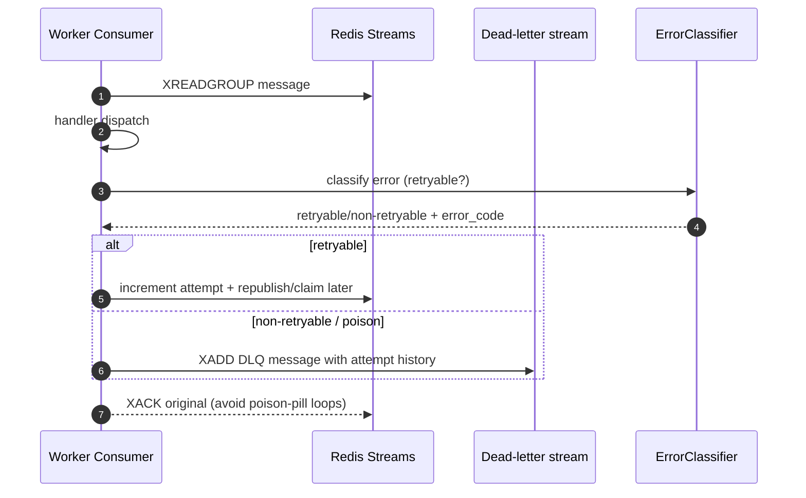

# TaskFlow AI - Production `ai-runtime` Service Architecture

This document designs a production-grade runtime for AI-native workflows:

- FastAPI API + streaming (SSE)
- LangGraph orchestration
- CrewAI multi-agent execution
- LiteLLM gateway/routing
- Redis Streams queue integration
- Memory retrieval (RAG/working memory hook)
- Audit logging + workflow persistence
- Retry + idempotency + dead-lettering

Design-only: it specifies responsibilities, interfaces, folder layout, and event flows without implementing business logic.

## 1) Folder Structure (Production-Ready Layout)

```txt
apps/ai-runtime/app/
  main.py                               # app wiring: routers, middleware, startup/shutdown

  core/
    config.py                            # env validation + settings
    context.py                           # request/job correlation context (ContextVars)
    ids.py                               # job_id/request_id/trace_id helpers
    time.py                              # timing utilities

  api/
    routes/
      health.py                         # /healthz + /readyz
      jobs.py                           # POST /jobs (enqueue), POST /jobs/{id}/resume
      events.py                         # GET /jobs/{id}/events (SSE)
    deps/
      container.py                      # DI container: config, publishers, services

  middleware/
    request_context.py                 # binds request_id/trace_id + tenant/job context
    error_to_event.py                 # converts exceptions into streaming-friendly events

  observability/
    logging.py                         # JSON structured logging + redaction policy
    metrics.py                         # metrics hook interface (optionally noop)
    tracing.py                         # tracing hook interface (optional)
    sink.py                             # ObservabilitySink dispatcher

  errors/
    taxonomy.py                         # error classes: retryable vs non-retryable
    classify.py                         # exception -> error category + retry decision
    http_handlers.py                   # FastAPI exception handlers

  interfaces/
    queue.py                            # QueueCommand/Event contracts
    streaming.py                        # EventPublisher / stream event contract
    persistence.py                      # WorkflowCheckpointStore + audit writer interfaces
    llm.py                              # LiteLLM router interface + request/response contracts
    memory.py                           # Memory retrieval interface + query/result contracts
    agents.py                           # AgentManager interface
    workflows.py                        # WorkflowEngine interface

  queue/
    redis_client.py                    # Redis Streams client wrapper
    messages/
      types.py                          # QueueCommand serialization + validation rules
      versioning.py                     # schema_version handling
    consumers/
      base.py                           # consumer loop (decode, idempotency, retry, ack, DLQ)
      workflow_consumer.py             # dispatch workflow commands
      agent_consumer.py                # dispatch agent commands (optional split)
    idempotency/
      store.py                          # processed-key guard (Redis-based)
    dlq/
      publisher.py                     # DLQ publisher contract + retry metadata

  eventing/
    redis_publisher.py                 # publishes WorkflowEvents to Redis-backed stream
    sse_broker.py                      # SSE broker reading events for a job_id
    schema.py                          # WorkflowEvent payload shapes + serialization

  ai/
    gateway.py                          # LiteLLM gateway wrapper (behind interfaces)
    routing.py                          # provider/model selection policy hook (LiteLLM params)
    streaming.py                        # token streaming adapter into WorkflowEvents
    middleware.py                      # AI middleware: LLM call timing, retries, event hooks

  memory/
    service.py                          # MemoryService facade (calls retrieval strategy later)
    retrieval/
      interfaces.py                     # Memory retriever interfaces (vector search, working memory)

  workflows/
    engine/
      runner.py                         # workflow lifecycle: start/resume + checkpointing
      checkpoints.py                    # checkpoint persistence orchestration
      state.py                          # canonical WorkflowState container shape
    graphs/
      graph_factory.py                  # LangGraph graph definition factory (nodes later)

  agents/
    manager/
      agent_manager.py                 # CrewAI multi-agent system orchestration (adapter-first)
      crew_factory.py                  # builds CrewAI crews for workflow roles (placeholder)
    tools/
      tool_registry.py                # tool adapter registry (later: real tool execution)
      tool_contracts.py              # tool input/output contracts

  integrations/
    litellm/
      adapter.py                        # LiteLLM adapter implementing interfaces/llm.py
    redis/
      adapter.py                        # Redis adapter used by queue/eventing
    crewai/
      adapter.py                        # CrewAI adapter implementing interfaces/agents.py
    langgraph/
      adapter.py                        # LangGraph adapter implementing workflows/graphs
    persistence/
      prisma_adapter.ts?               # (future) if you centralize persistence through TS packages

  tests/
    unit/
    integration/

scripts/
  run_worker.py                         # entrypoint for queue consumers (placeholder)
```

## 2) System Responsibilities (Who Owns What)

### `api/*` (FastAPI layer)

- Validates incoming requests (tenant + user/job context)
- Enqueues work by publishing queue commands (idempotent)
- Exposes streaming endpoint for job events (SSE)
- Avoids direct vendor SDK usage

### `queue/*` (Redis Streams execution)

- Owns consumer loop:
  - decode + validate command
  - idempotency guard
  - classify failures
  - dispatch to workflow/agent handlers
  - checkpoint persistence hooks
  - ack/nack + DLQ handling

### `workflows/*` (LangGraph lifecycle)

- Owns workflow execution lifecycle:
  - start -> create state -> run graph -> persist checkpoints
  - resume -> load checkpoint -> continue -> persist checkpoints
- Emits standardized `WorkflowEvent`s via eventing layer

### `agents/*` (CrewAI orchestration)

- Owns multi-agent orchestration flow:
  - configure agent roles for a workflow step (placeholder)
  - request LLM completions via LiteLLM gateway interface
  - inject memory context from memory retrieval interface
  - emit agent run/step events (via event emitter)

### `ai/*` (LiteLLM gateway + AI middleware)

- Owns LLM invocation concerns:
  - routing policies (model selection)
  - retries for transient provider failures
  - streaming adaptation to token deltas/events
- Emits AI middleware events for observability

### `memory/*` (retrieval service facade)

- Owns memory retrieval invocation points
- Always returns tenant-scoped retrieval results

### `eventing/*` (events & SSE)

- Converts runtime events into streamable SSE payloads
- Persists audit trails when required (via persistence interface)
- Ensures event ordering/termination conventions are consistent

### `observability/*` and `errors/*`

- JSON logging with correlation ids
- Metrics/tracing hook dispatch (optional)
- Error taxonomy + mapping to:
  - HTTP responses
  - queue retry/DLQ decisions
  - terminal streaming events

## 3) Production Event Flows

### A) Job initiation + streaming subscription



### B) Workflow execution + checkpointing + resume



### C) Queue retry / DLQ handling



## 4) Workflow Engine Design (LangGraph)

### Core interface

- `WorkflowEngine.start(input) -> job_id`
- `WorkflowEngine.resume(job_id, checkpoint_id) -> job_id`
- emits `WorkflowEvent`s during execution

### Responsibilities

- Construct a canonical `WorkflowState`
- Build/instantiate LangGraph graph via `graphs/graph_factory.py`
- Persist checkpoints at deterministic step boundaries
- Load checkpoint state for resume
- Ensure terminal events are always emitted:
  - `job_completed` or `job_failed`

### Checkpoint persistence contract

At each step boundary:

- persist:
  - `workflow_checkpoint(state_json, state_hash, checkpoint_seq, status)`
  - `workflow_run` status transition (if changed)
  - `audit_log` entries for workflow/agents
- publish events:
  - `checkpoint_saved`
  - relevant step transitions

Atomicity guideline:

- Either use a DB transaction or an outbox pattern so “checkpoint saved” and “events published” stay consistent (implementation later).

## 5) Agent Manager Design (CrewAI Multi-Agent)

### Core interface

- `AgentManager.run_agent(step_spec, workflow_context) -> AgentRunResult`

### Responsibilities

- Multi-agent selection:
  - determine which agent roles should execute for a given workflow step (decision logic later)
  - create CrewAI crew from `agents/manager/crew_factory.py` (adapter-first)
- Memory injection:
  - call memory retrieval interface to produce context
- LLM calls:
  - call LiteLLM gateway interface (never call LiteLLM SDK directly from orchestration)
- Event emission:
  - emit agent run + step events
  - emit tool call events
  - emit terminal success/failure events (propagate to workflow)

### Multi-agent event mapping

CrewAI internal events should be normalized into:

- `agent_run_started`, `agent_step_started`, `agent_tool_call`, etc.
- map agent failures to workflow error taxonomy so queue retry decisions stay consistent

## 6) Queue Consumer Architecture (Redis Streams)

### Consumer base responsibilities (`queue/consumers/base.py`)

- Create a stable consumer group name per tenant/queueKey
- Read messages:
  - `XREADGROUP` for commands stream
- Decode + validate `QueueCommand`:
  - verify `schema_version`
  - validate required fields (`tenant_id`, `job_id`, `idempotency_key`)
- Idempotency guard:
  - check `idempotency_key` in Redis
- Dispatch:
  - `workflow_consumer` -> workflow engine
  - `agent_consumer` -> agent manager
- Retry loop:
  - classify error -> retry or DLQ
- Ack:
  - ack only after persistence + safe event handling decisions

### DLQ responsibilities

- DLQ message includes:
  - original command metadata
  - attempt history
  - error_code + error_type
  - timestamp and correlation ids
- enable offline replay tooling later (not implemented now)

## 7) Event Emitters (Streaming Responses + Audit)

### Event contract

All emitted events must include:

- `schema_version`
- `event_type`
- `job_id`
- `tenant_id`
- `seq` (monotonic per job; produced by runner or persistence seq later)
- `trace_id`/`request_id` when available
- `payload` (redacted-safe)

### Implementation responsibilities (not business logic)

- `eventing/redis_publisher.py`
  - publish `WorkflowEvent` to Redis stream/topic
- `eventing/sse_broker.py`
  - read events for `job_id` and send as `text/event-stream`
- Ensure terminal events always end the SSE stream cleanly.

Audit logging integration:

- If audit persistence is required, emit audit events to DB alongside checkpoint writes (implementation later).

## 8) Logging System (Structured, Correlated, Redacted)

### Logging requirements

- Use JSON structured logs
- Always include:
  - `service: "ai-runtime"`
  - `env`
  - `tenant_id`
  - `job_id` (when present)
  - `request_id` (for API calls)
  - `trace_id` (optional)
  - `event` (short type)
  - `duration_ms` (for timed actions)
  - `attempt` (retry attempt number)
  - `error_code`, `error_type` on failure

### Correlation strategy

- API middleware generates `request_id` + optionally `trace_id`
- Queue command includes correlation ids
- Worker binds these ids into contextvars before logging

### Redaction policy

- Never log secrets, provider API keys, raw user PII
- Log only:
  - token counts/usage (if safe)
  - hashes/sizes of payloads
  - sanitized summaries

## 9) AI Middleware (LLM + Orchestration Guardrails)

AI middleware wraps calls and orchestration with cross-cutting concerns:

### Responsibilities

- LLM call timing + metrics
- Retry for transient provider errors
- Streaming token deltas:
  - adapt provider streaming output into normalized `token_delta` events
- Event emission consistency:
  - ensure AI middleware emits:
    - `llm_request_started`
    - `llm_request_completed`
    - `llm_request_failed`
- Memory retrieval integration points:
  - emit `memory_retrieval_started/completed` around retrieval calls

### Failure mapping

- Convert provider exceptions into:
  - retryable vs non-retryable error taxonomy
- Ensure workflow engine and queue retry decisions receive the same error_code taxonomy.

## 10) Scalability Notes (How to Scale Safely)

### Workers

- Scale by adding consumers to the same Redis consumer group
- Ensure idempotency + checkpoint persistence are correct before scaling up

### Streaming

- SSE connections can be long-lived:
  - prefer multiplexing with job-scoped event streams
  - add sampling under load

### Database

- Workflow checkpoints are write-heavy:
  - persist at deterministic boundaries
  - avoid dumping large states repeatedly (store references/hashes)

### Memory retrieval

- pgvector/embeddings can be expensive:
  - cache retrieval results per job (later)
  - batch embedding computations (later)

## 11) Engineering Guidelines (Production Conventions)

1. Contract-first
   - queue commands and stream events must be schemaed and versioned (`schema_version`)
2. Strict layering
   - vendor SDK imports only under `integrations/*`
3. Idempotency first
   - every queue message has `idempotency_key`
4. Deterministic checkpointing
   - save checkpoints at step boundaries used by resume logic
5. Terminal events always
   - job_completed/job_failed must always be emitted, even on errors
6. Tenant invariants
   - all persistence and retrieval calls must require `tenant_id`
7. Redaction by default
   - events/log payloads are redacted-safe unless explicitly in dev debug mode
