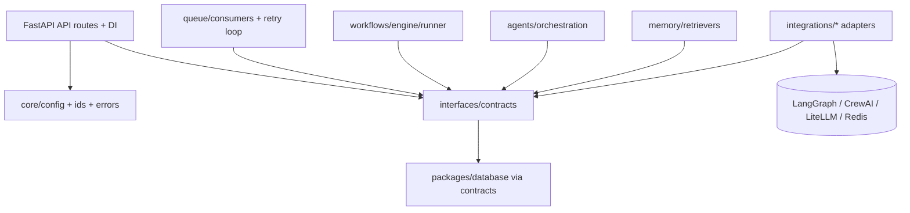
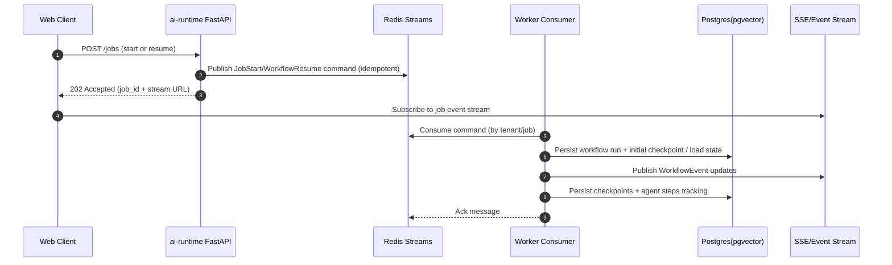

# TaskFlow AI - ai-runtime Architecture

This document details the internal architecture of `apps/ai-runtime` (FastAPI + LangGraph + CrewAI + LiteLLM + Redis consumers).

It is design-only: no business logic implementation.

## Responsibilities

The `ai-runtime` service owns:
- **API surface**
  - start jobs (start/resume) with tenant-scoped authorization
  - streaming endpoints for job event updates (SSE/WebSocket)
  - health/readiness endpoints
- **Queue-driven execution**
  - enqueue job commands and consume them via Redis Streams consumer groups
  - retry and dead-lettering of failed commands
  - idempotency of queue command processing
- **Workflow execution**
  - LangGraph workflow runner with state + checkpoint persistence
  - resume support based on checkpoint identifiers
  - emission of standardized workflow events for streaming/audit
- **Agent orchestration**
  - CrewAI integration through adapter interface
  - memory context injection (retrieval interface)
  - normalization of agent/tool/model events into workflow-compatible events
- **LLM routing**
  - LiteLLM routing abstraction behind an interface
  - optional streaming token deltas to the event stream
- **Persistence + audit**
  - persist workflow runs/checkpoints and agent tracking in Postgres (via shared `packages/database`)
  - write audit logs consistently

## Internal Module Structure (Proposed)

Key layers:

This keeps vendor-specific imports isolated under `integrations/`.

## Execution Lifecycle (Event Flow)

### 1) Start / Resume job

### 2) Streaming events

Event emission should be:
- correlated by `job_id` and `tenant_id`
- consistent in shape:
  - `event_type`
  - `seq` / `event_id` (for ordering)
  - `payload` (redacted-safe)
- terminal events:
  - `job_completed`
  - `job_failed` (with `error_code`)

## Queue Consumer Architecture (within ai-runtime)

Consumers are responsible for:
- message decode -> validate -> classify -> dispatch handler
- idempotency guard before executing side effects
- retry/backoff for transient errors
- DLQ publishing for permanent errors / poison pills
- consistent logging + audit on every attempt

Details of the queue system live in `docs/architecture/queue-system.md`.

## Workflow Engine (LangGraph) Structure

The workflow engine is split into:
- graph factory (`workflows/graphs/graph_factory.py`)
- runner (`workflows/engine/runner.py`)

The runner handles:
- start/resume modes
- checkpoint persistence
- translating graph steps into standardized events

The graph factory should be treated as “definition only”:
- nodes are placeholders until business logic is added later

## Agent Orchestration Structure (CrewAI)

The agent orchestration layer should:
- build agent context via memory retrieval interface
- connect to CrewAI execution via adapter interface
- translate tool calls/model events to normalized events for streaming + audit
- persist agent runs/steps/tool calls to Postgres

Agent orchestration should never depend directly on:
- Redis details
- LiteLLM SDK calls
- CrewAI SDK details

Those belong to `integrations/*`.

## Observability Hooks (required instrumentation points)

Instrument these boundaries:
- API entry/exit: validation duration, job_id created
- queue consume: latency, attempts, handler duration
- persistence: checkpoint save/load duration
- LLM invocation: provider/model, latency, usage
- memory retrieval: retrieval time, item counts
- workflow transitions: step durations, checkpoint seq

In dev: allow turning off expensive hooks (sampling).

## Engineering Guidelines

- **No vendor SDK imports outside `integrations/`**
- **Contract-first**: queue commands and streaming events must be schemaed
- **Idempotency**: queue handler must be safe under retries
- **Checkpointing**: persist at deterministic step boundaries for reliable resume
- **Tenant invariants**: always include `tenant_id` in API, queue, and persistence layers
- **Redaction**: logs and events must not include secrets or raw sensitive content

