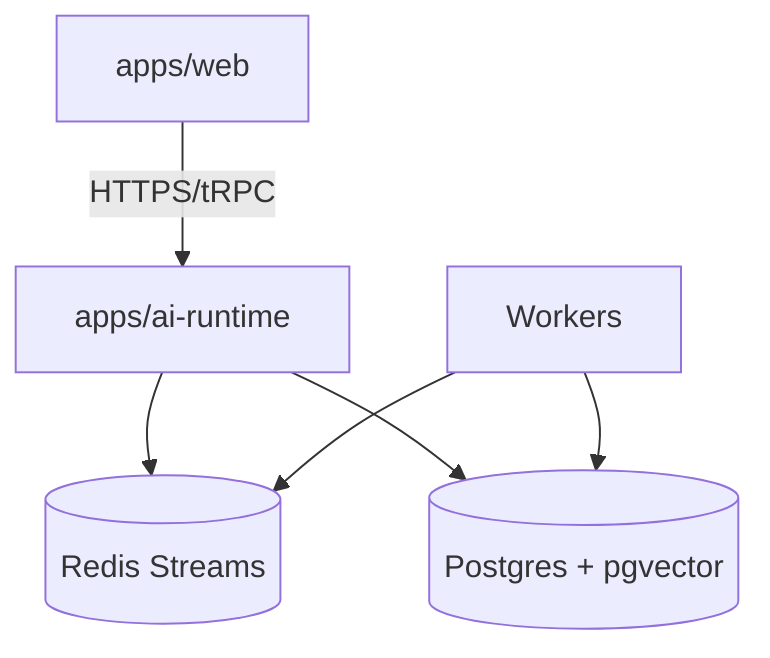
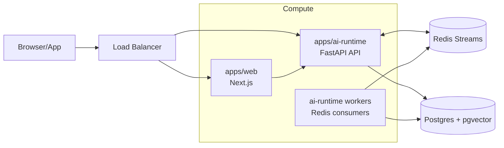

# TaskFlow AI - Deployment Topology

This document describes how to deploy TaskFlow AI components in local and production environments.

## Local Development Topology (Docker)

At minimum, local development should provide:
- `redis` (queue + streaming fanout primitives)
- `postgres` (workflow persistence + audit logs + memory storage)

The repo already includes `docker-compose.yml` with Redis.

Suggested local additions:
- a Postgres container with `pgvector` enabled
- optional pgAdmin/inspection tooling

## Production Topology (Recommended)

### Components
- Reverse proxy / load balancer:
  - terminates TLS
  - routes to web and ai-runtime
- `apps/web`:
  - stateless Next.js server
  - uses Auth.js (session/JWT handling)
- `apps/ai-runtime`:
  - FastAPI instances for:
    - job start/resume endpoints
    - streaming endpoints (SSE)
- Queue workers:
  - separate worker processes/containers for:
    - consuming Redis Streams
    - executing workflows/agents
    - persisting checkpoints and audit logs
- Data plane:
  - managed Redis (durable streams)
  - managed Postgres with `pgvector` extension

### Diagram

## Scaling Notes

1. Scaling web
- Scale horizontally (stateless instances).
- Ensure sessions/storage strategy supports multiple instances (Auth.js configuration).

2. Scaling ai-runtime API
- Scale FastAPI instances for:
  - `POST /jobs`
  - `GET /jobs/{job_id}/events` streaming endpoints
- SSE connections are long-lived; tune instance resources and consider connection limits.

3. Scaling workers
- Scale workers by increasing the number of consumers in the same consumer group.
- Keep workers idempotent and rely on checkpoint persistence for resume.

## Streaming Considerations

- SSE/WebSocket streaming should be job-scoped.
- Event emission should be consistent and correlated (`job_id`, `tenant_id`, `seq`).
- Consider batching token deltas into fewer events when under load.

## Observability & Operations

Required:
- structured logs for `ai-runtime` with correlation ids:
  - `job_id`, `tenant_id`, `request_id`, `trace_id` (if used)
- metrics:
  - queue lag, handler duration, retry counts
  - checkpoint save/load latency
  - LLM call latency and token usage (when available)
- tracing (optional but recommended):
  - instrument workflow steps and LLM calls for end-to-end visibility

## Environment Configuration & Validation

- Each service must validate environment variables at startup.
- Provide per-service `.env.example` and shared validation schema where possible.
- Never allow “missing env” to be silently defaulted for production:
  - fail fast with clear error messages.

## Engineering Guidelines

- Treat migrations as a first-class deployment step:
  - ensure compatibility with running workers during rolling deploys
- Ensure DLQ and replay tooling exists operationally:
  - DLQ payload must include enough metadata to re-run safely
- Backup & retention:
  - pgvector tables can grow quickly; enforce retention policies for memory and event logs

