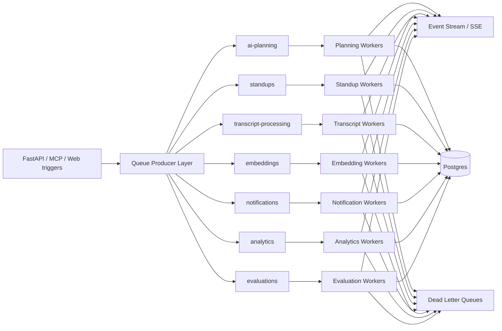

# TaskFlow AI - Queue Architecture (BullMQ)

This document defines a production-grade queue architecture for TaskFlow AI using **BullMQ**.

Queues:

- `ai-planning`
- `standups`
- `transcript-processing`
- `embeddings`
- `notifications`
- `analytics`
- `evaluations`

Design goals:

- retries + dead-letter queues
- observability + event streaming
- job prioritization
- concurrency control
- workflow integration
- failure recovery

---

## 1) Queue Architecture

## 1.1 Topology

Use a dedicated BullMQ queue per workload domain:

- `ai-planning`: workflow planning and decomposition jobs
- `standups`: standup summarization and nudge scheduling
- `transcript-processing`: transcript parsing/extraction jobs
- `embeddings`: embedding generation and reindex/backfill
- `notifications`: user-facing message dispatch
- `analytics`: metric aggregation and telemetry jobs
- `evaluations`: model/workflow quality evaluation runs

Recommended Redis key prefix:

- `taskflow:{env}:{tenant}` or `taskflow:{env}` + tenant in payload

Queue primitives:

- `Queue` for producers
- `Worker` for consumers
- `QueueScheduler` for retries/delays/stalled jobs
- `QueueEvents` for lifecycle events (for observability and streaming)

## 1.2 Flow diagram



---

## 2) Worker Structure

Use one process group per queue type, with shared worker runtime utilities.

Suggested structure:

```txt
apps/ai-runtime/app/queue/
  bullmq/
    connection.py                # redis connection builder
    queue_factory.py             # creates Queue + Scheduler + Events
    worker_factory.py            # worker bootstrap with defaults
    events/
      emitter.py                 # queue/job event emission
      adapters.py                # stream/SSE adapters
    middleware/
      tracing.py                 # request/job correlation
      logging.py                 # structured logs
      isolation.py               # tenant/workspace checks
      idempotency.py             # de-dup guard
    jobs/
      interfaces.py              # common job envelope
      ai_planning.py             # payload/result contracts
      standups.py
      transcript_processing.py
      embeddings.py
      notifications.py
      analytics.py
      evaluations.py
    processors/
      ai_planning_processor.py
      standups_processor.py
      transcript_processor.py
      embeddings_processor.py
      notifications_processor.py
      analytics_processor.py
      evaluations_processor.py
    retry/
      policies.py                # per queue retry strategy
      classifier.py              # retryable vs non-retryable
    dlq/
      router.py                  # move failed jobs to DLQ
      replay.py                  # controlled replay tooling
```

Worker conventions:

- enforce workspace isolation at processor entry
- always emit start/progress/completed/failed events
- classify errors before final failure
- write audit logs for terminal outcomes

---

## 3) Job Interfaces

All jobs use a shared envelope.

```ts
type JobEnvelope<TPayload> = {
  schemaVersion: '1';
  jobType: string;
  tenantId: string;
  workspaceId: string;
  workflowRunId?: string;
  correlationId: string; // request or trace link
  idempotencyKey: string;
  attempt: number;
  createdAt: string;
  payload: TPayload;
};
```

Per queue payload strategy:

- `ai-planning`:
  - input refs, planning objective, constraints, model policy
- `standups`:
  - team/workspace refs, period, nudge config
- `transcript-processing`:
  - transcript ref, language, extraction profile
- `embeddings`:
  - entity refs, embedding model key, chunk policy
- `notifications`:
  - channel, recipient, template key, delivery policy
- `analytics`:
  - aggregation window + metric family
- `evaluations`:
  - eval suite key, model/workflow version, sample set ref

Result envelope:

```ts
type JobResult = {
  ok: boolean;
  outputRef?: string;
  metrics?: Record<string, number>;
  errorCode?: string;
  errorDetails?: Record<string, unknown>;
};
```

---

## 4) Retry Strategy

## 4.1 Retry classes

Retryable failures:

- transient network/Redis/provider timeouts
- temporary DB contention
- upstream rate limits

Non-retryable failures:

- validation/schema mismatch
- workspace/tenant isolation violations
- deterministic domain errors (e.g. malformed transcript format)

## 4.2 Backoff defaults (recommended)

- `ai-planning`: max 5 attempts, exponential (base 1s, cap 60s)
- `standups`: max 4 attempts, exponential (base 2s, cap 120s)
- `transcript-processing`: max 5 attempts, exponential (base 2s, cap 180s)
- `embeddings`: max 6 attempts, exponential (base 3s, cap 300s)
- `notifications`: max 8 attempts, exponential (base 1s, cap 600s)
- `analytics`: max 3 attempts, fixed or exponential (batch-safe)
- `evaluations`: max 3 attempts, exponential (base 5s, cap 300s)

Use jitter to avoid retry storms.

## 4.3 Dead-letter queues

DLQ naming:

- `{queueName}.dlq` (e.g., `ai-planning.dlq`)

DLQ record should include:

- original envelope
- failure classification
- attempt history and timestamps
- terminal error code/message

Replay policy:

- only replay via explicit operator command
- attach replay metadata and increment replay counter

---

## 5) Monitoring Strategy

## 5.1 Operational metrics

Track per queue:

- enqueue rate
- active jobs
- wait time / queue lag
- processing time (p50/p95/p99)
- success/failure counts
- retry counts
- DLQ inflow
- stalled jobs

Track resource metrics:

- worker CPU/memory
- Redis ops/latency/memory
- DB write latency for queue side effects

## 5.2 Observability events

Emit structured events for each lifecycle stage:

- `job_enqueued`
- `job_started`
- `job_progress`
- `job_completed`
- `job_failed`
- `job_retried`
- `job_moved_to_dlq`

Event fields:

- queue, jobType, jobId
- tenantId, workspaceId
- correlationId, workflowRunId
- attempt, durationMs
- errorCode (if any)

## 5.3 Dashboards & alerting

Alert on:

- queue lag threshold breach
- sudden DLQ spikes
- repeated failures by jobType
- stalled jobs > threshold
- worker saturation

---

## 6) Job Prioritization

Use BullMQ priorities:

- `1` = critical
- `5` = high
- `10` = normal
- `20` = low

Suggested defaults:

- `notifications`: high (user-facing)
- `ai-planning`: high for interactive requests, normal for batch
- `standups`: time-based high near standup window
- `transcript-processing`: normal
- `embeddings`: low/normal (background heavy)
- `analytics`: low
- `evaluations`: low/normal

---

## 7) Concurrency Control

Per queue worker concurrency (initial baseline):

- `ai-planning`: 10
- `standups`: 8
- `transcript-processing`: 6
- `embeddings`: 4 (CPU/IO heavy)
- `notifications`: 20
- `analytics`: 4
- `evaluations`: 3

Add controls:

- queue-specific rate limiting in BullMQ
- tenant fairness caps (prevent noisy-neighbor effects)
- adaptive concurrency (auto-scale workers by lag)

---

## 8) Workflow Integration

BullMQ jobs should map directly to workflow lifecycle steps:

- workflow engine publishes jobs to relevant queues
- completion/failure updates workflow state/checkpoints
- approval-required states pause downstream enqueues

Integration pattern:

- step boundary checkpoint saved -> enqueue next job
- on job failure:
  - classify error
  - retry or mark workflow as failed and emit terminal event

---

## 9) Event Streaming

Queue events flow into streaming infrastructure:

- QueueEvents -> event emitter -> Redis stream/SSE channel -> UI/API subscribers

This enables real-time progress:

- planning progress
- transcript extraction status
- embedding batch progress
- notification delivery outcomes

---

## 10) Failure Recovery

Recovery mechanisms:

- stalled job detection and reprocessing
- idempotency keys to prevent duplicate side effects
- checkpoint-based workflow resume
- DLQ + replay tooling
- bounded retries with jitter

Recovery playbook:

1. identify failing queue/job type
2. inspect DLQ + failure distribution
3. deploy fix or config change
4. replay safe subset from DLQ
5. verify success metrics and close incident
