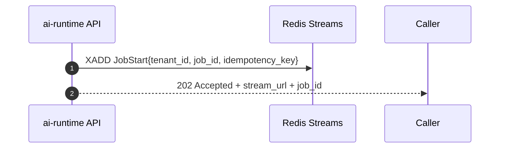
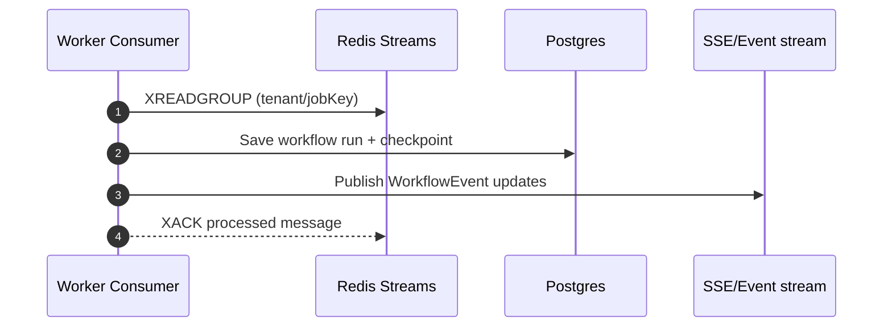

# TaskFlow AI - Queue System (Redis Streams)

This document designs the queue/worker system for asynchronous AI job execution.

The queue system is used by `apps/ai-runtime`:
- API publishes commands (start/resume/run)
- worker consumers process commands and emit streaming events

## Queue Model

Use **Redis Streams** for durability + replay:
- Commands go into a stream (append-only)
- Workers form consumer groups to parallelize processing
- Each message is acknowledged only after successful processing

### Naming conventions

Recommended:
- stream: `taskflow:queue:{env}:{tenant}:{queueKey}`
- consumer group: `taskflow:workers:{env}:{tenant}:{queueKey}`

Where:
- `env`: `dev|staging|prod`
- `tenant`: a tenant identifier (or `global` for system-wide tasks)
- `queueKey`: logical queue partition (e.g. `workflow`, `agent`, or `jobs`)

## Message Contracts

All queue messages must be schemaed and versioned.

### Command messages (inputs)
- `command_type`
  - `JobStart`
  - `WorkflowExecute`
  - `WorkflowResume`
  - `AgentRun`
- `message_id` (unique for dedup)
- `idempotency_key` (dedup key for safe retries)
- `tenant_id`
- `job_id`
- `attempt` (incremented by consumer retry loop)
- `schema_version`
- `payload` (command-specific parameters)

### Event messages (optional, for streaming/audit)
- `event_type` (e.g., `workflow_step_completed`, `job_failed`)
- `event_id` / `seq`
- `tenant_id`, `job_id`
- `payload`

Events can be delivered to clients directly via the streaming layer, and optionally persisted for audit.

## Consumer Architecture (Worker Loop)

Each consumer runs the same loop structure:

```mermaid
flowchart TD
  A[Read from Redis Stream] --> B[Decode + validate contract]
  B --> C[Idempotency check]
  C --> D[Dispatch handler: workflow/agent runner]
  D --> E[Persist checkpoint / tracking (DB)]
  E --> F[Publish streaming event(s)]
  F --> G[Ack message]
  D --> H{Error classification}
  H -->|Retryable| I[Backoff + retry attempt]
  H -->|Non-retryable/Poison| J[DLQ publish + record failure]
  J --> G
```

## Idempotency Strategy

Idempotency is required because:
- retries happen
- workers may be restarted mid-processing

Recommended:
- maintain a Redis key set:
  - `taskflow:idem:{env}:{tenant}:{idempotency_key}`
- set TTL slightly longer than maximum processing window
- if key exists: ack and skip side effects

## Retry Policy + Dead Letter Queue

### Retry classification
- Retryable:
  - provider timeouts, rate limits (depending on policy)
  - transient Redis errors/network issues
  - temporary persistence/serialization conflicts
- Non-retryable:
  - invalid command payload
  - schema_version incompatibility without a migration path
  - unrecoverable persistence corruption

### DLQ
After `max_attempts`:
- write message to `taskflow:dlq:{env}:{tenant}:{queueKey}` stream
- include `last_error_code` + `attempt` in DLQ payload
- emit terminal failure event (`job_failed`) to streaming layer

## Event Flows

### Command publish flow (API -> queue)


### Execution flow (Queue -> worker -> streaming)


## Scalability Notes

1. Horizontal worker scaling
   - increase consumer count in the same consumer group
   - ensure handlers are idempotent and checkpointed

2. Stream partitioning
   - keep “hot” tenants from dominating a single consumer by using `queueKey` or sharding by tenant/job_id

3. Backpressure
   - implement a max in-flight limit per worker
   - optionally pause/slow token streaming if event stream consumers lag

## Engineering Guidelines

- Always include:
  - `tenant_id`, `job_id`, `idempotency_key`, `schema_version`
- Ack only after:
  - persistence writes (checkpoint/audit/tracking) and
  - event emission decisions are safely completed (or outboxed)
- DLQ payload must include enough metadata for offline replay:
  - original payload hash, message_id, attempt history, error classification

