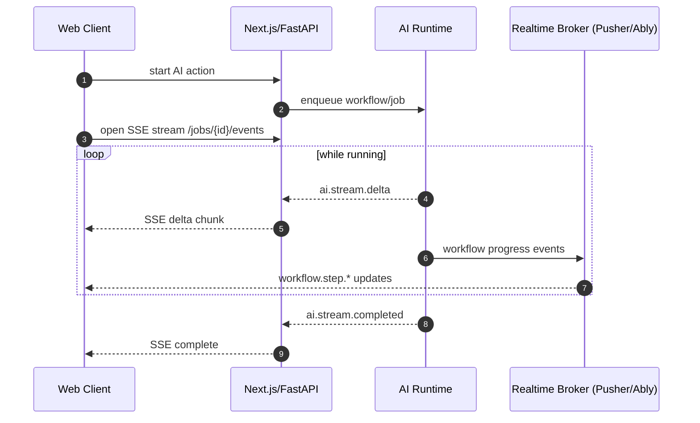

# TaskFlow AI - Realtime Architecture

This document defines the production-grade realtime architecture for TaskFlow AI with:

- collaborative boards
- AI streaming responses
- live workflow updates
- notifications
- user presence
- optimistic updates

Tech alignment:

- Pusher **or** Ably (managed realtime backbone)
- TanStack Query (client cache + invalidation layer)
- WebSockets + SSE

---

## 1) Event Architecture

## 1.1 Event model

Use a normalized event envelope across all realtime channels:

```ts
type RealtimeEvent<T = Record<string, unknown>> = {
  schemaVersion: '1';
  eventId: string;
  eventType: string;
  occurredAt: string;

  tenantId: string;
  workspaceId: string;
  actorId?: string;
  correlationId?: string; // links API request/workflow run

  entityType?: 'task' | 'board' | 'workflow' | 'notification' | 'presence';
  entityId?: string;
  payload: T;
};
```

## 1.2 Event domains

### Board collaboration events

- `board.item.created`
- `board.item.updated`
- `board.item.moved`
- `board.item.deleted`
- `board.column.updated`

### Workflow + AI runtime events

- `workflow.started`
- `workflow.step.started`
- `workflow.step.completed`
- `workflow.checkpoint.saved`
- `workflow.completed`
- `workflow.failed`

### AI streaming events

- `ai.stream.started`
- `ai.stream.delta` (token/partial chunk)
- `ai.stream.completed`
- `ai.stream.failed`

### Notifications

- `notification.created`
- `notification.read`
- `notification.dismissed`

### Presence

- `presence.joined`
- `presence.left`
- `presence.heartbeat`
- `presence.state.updated` (cursor/selection/active board)

## 1.3 Channel partitioning

Recommended naming:

- `tenant.{tenantId}.workspace.{workspaceId}.board.{boardId}`
- `tenant.{tenantId}.workspace.{workspaceId}.workflow.{workflowRunId}`
- `tenant.{tenantId}.workspace.{workspaceId}.notifications.{userId}`
- `tenant.{tenantId}.workspace.{workspaceId}.presence.{boardId}`

This keeps isolation strict while limiting fanout.

---

## 2) Streaming Strategy

Use **hybrid transport**:

1. **SSE** for AI token streaming (server -> client, ordered, lightweight)
2. **WebSockets (Pusher/Ably)** for collaborative state + presence + notifications

## 2.1 Why hybrid

- SSE is ideal for continuous append-only AI deltas.
- WebSockets are ideal for bidirectional presence and board collaboration.

## 2.2 AI stream flow



## 2.3 Realtime broker choice

Both Pusher and Ably fit; choose based on ops constraints:

- **Pusher**: straightforward channel/event model
- **Ably**: stronger delivery/ordering features and richer presence APIs

Abstract broker behind `RealtimeGateway` interface so backend is swappable.

---

## 3) Optimistic Update Strategy

Use TanStack Query mutation lifecycle for optimistic UX:

1. `onMutate`: snapshot current cache + apply optimistic patch
2. server request dispatched
3. if success: replace optimistic entry with authoritative server result
4. if error: rollback from snapshot + show inline error

## 3.1 Idempotency + reconciliation

- every mutation sends `clientMutationId`
- server includes `clientMutationId` in emitted realtime event payload
- client ignores duplicate application if event already reconciled

## 3.2 Conflict handling

- authoritative server state always wins
- if optimistic state diverges:
  - patch cache with authoritative event
  - show subtle “updated” indicator when user-edited values were changed by server validation/rules

---

## 4) Cache Synchronization (TanStack Query)

## 4.1 Source of truth policy

- Query cache is the UI source of truth.
- Realtime events are incremental cache patch inputs.
- Periodic refetch guards against missed events.

## 4.2 Sync mechanisms

1. **Targeted patching** for small updates:
   - `queryClient.setQueryData` on entity-level events
2. **Selective invalidation** for structural changes:
   - `queryClient.invalidateQueries` for list/order dependencies
3. **Background reconciliation**:
   - scheduled refetch on reconnect/tab focus

## 4.3 Event ordering

- maintain per-entity `version` or monotonic `updatedAt` in payload
- drop stale events in client reducer
- if sequence gap detected, trigger hard refetch for affected query keys

---

## 5) Presence System

Presence is board-scoped and ephemeral.

## 5.1 Presence state model

```ts
type PresenceState = {
  userId: string;
  displayName: string;
  boardId: string;
  status: 'online' | 'idle' | 'away';
  lastSeenAt: string;
  cursor?: { x: number; y: number };
  selection?: { entityType: string; entityId: string };
};
```

## 5.2 Presence lifecycle

- join board channel -> publish `presence.joined`
- heartbeat every N seconds
- inactivity timeout marks user idle/away
- disconnect publishes `presence.left` (or server timeout fallback)

## 5.3 Presence scaling

- keep presence data in broker ephemeral presence state
- avoid writing every heartbeat to Postgres
- optionally persist coarse “last active” snapshots at low frequency for analytics

---

## 6) Failure and Recovery

## 6.1 Client-side resilience

- auto-reconnect WebSocket with backoff
- SSE reconnect with `Last-Event-ID` when supported
- on reconnect:
  - refetch critical queries
  - resubscribe channels
  - reconcile pending optimistic mutations

## 6.2 Server-side resilience

- event outbox pattern for durability:
  - write domain event in DB transaction
  - relay service publishes to Pusher/Ably
- prevents dropped events between DB commit and broker publish

## 6.3 Missed event handling

- include event sequence in payload per channel/entity
- detect gaps and trigger targeted resync APIs:
  - `/boards/{id}/sync?sinceVersion=...`
  - `/workflows/{id}/events?sinceSeq=...`

---

## 7) Implementation Guidelines

1. Keep event contracts versioned (`schemaVersion`).
2. Enforce tenant/workspace isolation in channel naming + auth.
3. Use SSE for long AI text streams; WebSocket for collaboration/presence.
4. Prefer cache patching over blanket invalidation for responsiveness.
5. Ensure optimistic mutation rollback is deterministic.
6. Always reconcile on reconnect to prevent silent divergence.
