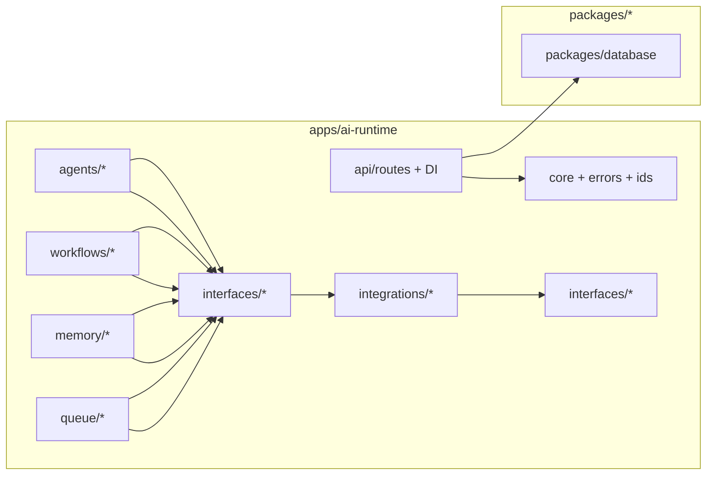

# TaskFlow AI - Service Boundaries & Dependency Contracts

This document describes how the monorepo components relate, what each service owns, and the dependency rules that prevent architectural drift.

## High-Level Service Boundaries

### `apps/web` (Next.js)
Owns:
- UI rendering
- Auth.js integration
- tRPC API surface for initiating jobs
- Client-side streaming subscription orchestration

Does:
- Validates user input and authorization (tenant resolution)
- Calls ai-runtime endpoints to start/resume jobs and stream events

Does not:
- Import vendor AI SDKs (LiteLLM/LangGraph/CrewAI)

### `apps/ai-runtime` (FastAPI)
Owns:
- Job lifecycle and execution orchestration
- Redis queue consumption (background execution)
- LangGraph workflow execution runner and resume
- CrewAI agent orchestration glue
- LiteLLM routing
- Memory retrieval integration
- Streaming responses (SSE/WebSocket)
- Structured logging and observability hook dispatch

### `packages/database` (Prisma + PostgreSQL + pgvector)
Owns:
- Canonical Prisma schema and migration strategy
- Multi-tenant audit logs
- AI agent tracking tables
- Workflow run + checkpoint persistence tables
- Memory storage tables and embeddings

Does not:
- Execute workflows/agents
- Contain runtime orchestration logic

## Dependency Rules (Engineering Boundaries)

To keep the system maintainable, enforce “layer direction”:

### Rules of thumb

1. Vendor SDK imports stay localized
   - `apps/ai-runtime/app/integrations/*` is the only place that should import:
     - LiteLLM
     - LangGraph
     - CrewAI
     - Redis-specific SDK patterns

2. Cross-layer calls go through interfaces
   - `apps/ai-runtime/app/interfaces/*` defines contracts.
   - Business orchestration modules (agents/workflows/queue consumers) depend on interfaces, not vendors.

3. Tenant context is a first-class value
   - Every API request and queue command carries `tenant_id`.
   - Every persistence write includes `tenant_id`.

4. Contract versioning
   - Queue commands/events and streaming events should include:
     - `schema_version`
     - stable `event_type` / `command_type`
   - When contracts evolve, maintain backward compatibility for at least one release cycle.

## Contract Surfaces (What must be shared)

At minimum, the following should converge into shared schemas (later via `packages/shared-types`):
- Queue commands (JobStart, WorkflowExecute, WorkflowResume, AgentRun)
- Streaming events (WorkflowEvent updates and terminal completion/failure)
- Error contracts (`error_code`, `retryable` classification)

## Engineering Guidelines

- Add new capabilities by:
  1. extending interfaces
  2. adding adapter implementations under `integrations/`
  3. wiring orchestration modules to use interfaces
- Avoid circular dependencies between:
  - `queue/*` and `workflows/*` (queue should dispatch via interfaces)
  - `agents/*` and `workflows/*` (link through events/state, not direct imports)
- Keep “persistence writes” close to orchestration step boundaries:
  - the step that knows what changed also knows what checkpoint/state should be persisted

