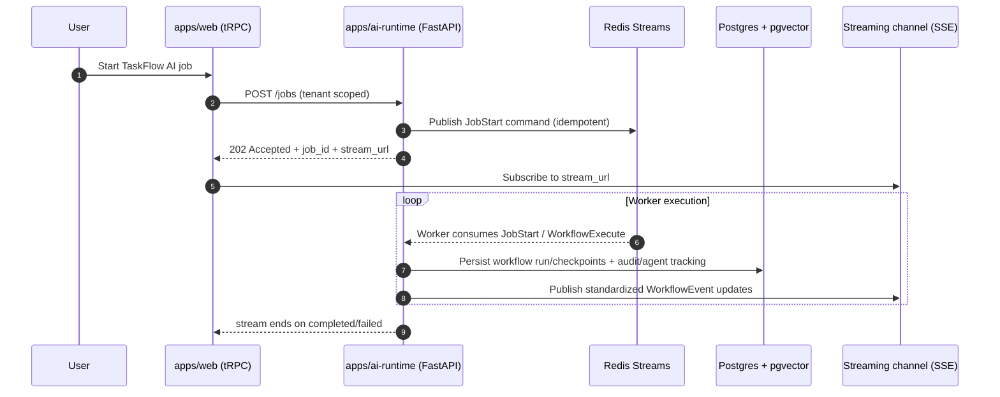

# TaskFlow AI - System Overview (Architecture Design)

TaskFlow AI is an AI-native SaaS built as a production-ready monorepo:
- `apps/web`: Next.js app (Auth.js + tRPC)
- `apps/ai-runtime`: FastAPI service that runs LangGraph workflows and CrewAI agents
- `packages/*`: shared contracts/config plus the canonical database schema
- `Redis + PostgreSQL(pgvector)`: durable queueing, checkpoint persistence, and memory storage

## Core Components

### Web App (`apps/web`)
- User-facing UI and authenticated API surface via tRPC
- Initiates AI jobs (start workflow / agent run)
- Subscribes to streaming job events for real-time updates

### AI Runtime (`apps/ai-runtime`)
- FastAPI REST endpoints for job lifecycle and streaming endpoints (SSE)
- Queue consumers that execute workflows/agents asynchronously
- LiteLLM routing to providers
- Memory retrieval integration
- Workflow persistence and checkpointing
- Structured logging + observability hooks

### Queue + Workers (Redis Streams)
- Durable command queue for asynchronous execution
- Consumer groups for horizontal scaling
- DLQ for poison-pill failures

### Database (`packages/database`)
- Canonical Prisma schema
- Multi-tenant audit logs
- Workflow persistence (workflow runs + checkpoints)
- AI agent tracking (runs + steps)
- Memory storage using PostgreSQL `pgvector`

## Tenant Model

The system uses a shared Postgres schema with `tenant_id` column-scoped data:
- Every tenant-scoped record includes `tenant_id` and participates in tenant-scoped indexes/uniques.
- Admin/global catalogs may exist without `tenant_id` if needed later.

## End-to-End Event Flow (Job Start + Streaming)

### Standardized event contracts
Events pushed to the streaming layer must be correlated via:
- `job_id`
- `tenant_id`
- `trace_id` / `request_id` (if available)

## Responsibilities Matrix

### Web responsibilities
- Authentication and authorization integration (Auth.js)
- Job initiation (create queue command)
- Client streaming subscription
- Mapping event stream to UI state

### ai-runtime responsibilities
- Validate request inputs and enforce tenant context
- Own execution lifecycle:
  - start/resume workflow execution
  - run agent orchestration
  - invoke LiteLLM routed calls
  - retrieve memory context for prompts
- Publish streaming events during execution
- Persist workflow/agent/audit records
- Consume queue commands and retry safely

### Queue responsibilities
- Durable command storage and replay capability
- Retry tracking via attempts/dead-lettering
- Horizontal worker scaling through consumer groups

### Database responsibilities
- Durable workflow checkpoint persistence
- Durable audit and agent tracking
- Memory embeddings storage using pgvector

## Scalability Notes

1. **Workers scale independently**
   - Use Redis Stream consumer groups; add more consumers to increase throughput.
   - Partitioning strategy should aim for stable ordering per `job_id` where required.

2. **Streaming fan-out**
   - Streaming should subscribe per job/request, not per token.
   - Consider throttling event emission (e.g., token deltas batched) later.

3. **Database hotspots**
   - Workflow checkpoints can generate frequent writes.
   - Mitigation: checkpoint at step boundaries, compress state JSON, and index by `(tenant_id, workflow_run_id)`.

4. **Memory retrieval cost**
   - Retrieval should reuse cached embeddings where possible later.
   - Use pgvector indexes tuned for the expected retrieval patterns.

## Engineering Guidelines

- **Contract-first design**: define request/command/event schemas before implementing handlers.
- **Vendor SDK isolation**: keep LiteLLM/LangGraph/CrewAI/Redis SDK usage under `apps/ai-runtime/app/integrations/*`.
- **Idempotency everywhere**: queue command handling must be safe to retry.
- **Tenant invariants**: no DB writes without `tenant_id`; enforce via schema + app-layer validation.
- **Observability by default**: every job execution must emit:
  - structured logs with `job_id`
  - standardized event stream updates
  - audit log entries for compliance

