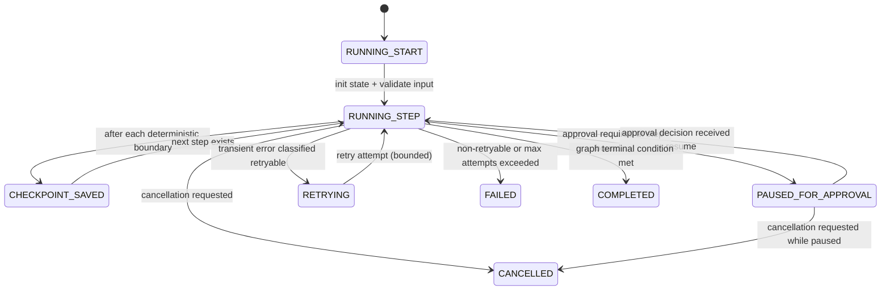

# TaskFlow AI - Foundational Workflow Architecture (LangGraph)

This document defines the **foundational** workflow architecture for `apps/ai-runtime` using **LangGraph** with:

- stateful execution
- deterministic persistence + resume
- retry support
- human approval checkpoints
- streaming updates (event-driven)
- queue integration
- audit logging hooks
- cancellation and error recovery

Design constraints:

- No business logic implementation yet.
- The design is contract-first: types, lifecycle, persistence/queue interfaces, and observability points.

## 1) Folder Structure (Proposed)

```txt
apps/ai-runtime/app/workflows/
  __init__.py

  state/
    __init__.py
    types.py                         # shared workflow state + checkpoints + approval models

  events/
    __init__.py
    types.py                         # WorkflowEvent + event payload contracts
    emitter.py                       # EventPublisher/EventEmitter port (no implementation)

  engine/
    __init__.py
    runner.py                        # WorkflowEngine lifecycle: start/resume/cancel (skeleton)
    lifecycle.py                     # graph lifecycle state machine (design-time)
    persistence_port.py             # Workflow persistence port (interface only)
    retry_port.py                   # retry policy + error classifier ports
    approvals_port.py               # human approval pause/resume ports
    error_recovery.py               # recovery strategy contract (design only)

  graphs/
    __init__.py
    graph_factory.py                # builds LangGraph graph from definition (placeholder)
    definitions/
      sprint_planning.py
      daily_standup.py
      meeting_transcript_processing.py
      risk_prediction.py
      task_prioritization.py      # graph factories (stubs only)

  registry/
    __init__.py
    workflow_registry.py            # mapping workflow_key -> definitions + schemas
```

## 2) Workflow Engine Architecture

### Key responsibilities

The workflow engine (`engine/runner.py`) is responsible for:

- creating/resuming stateful workflow runs
- executing LangGraph graphs in a controlled lifecycle
- checkpointing at deterministic step boundaries
- pausing for human approvals
- emitting standardized streaming events
- integrating retries, cancellation, and error recovery
- coordinating audit log emission through persistence/audit ports

### Core interfaces (conceptual)

The engine exposes (design-only):

- `start(WorkflowStartInput) -> WorkflowStartResult`
- `resume(WorkflowResumeInput) -> WorkflowResumeResult`
- `cancel(CancelInput) -> CancelResult`

It consumes only ports:

- persistence port: load/save workflow runs and checkpoints
- event emitter port: publish streaming events
- retry + error classifier ports: decide retryability
- approval ports: pause/resume on approval decisions

## 3) Shared Workflow State Types (Contract)

Workflows must use a state shape that is:

- JSON-serializable (for checkpoint persistence)
- deterministic (same inputs produce same state transitions)
- tenant-safe (always carries `tenant_id`)

### Canonical state (high level fields)

Every workflow state must include:

- identity/correlation:
  - `tenant_id`, `job_id`, `workflow_key`, `workflow_version`
  - correlation ids (`request_id`, `trace_id`) if available
- lifecycle:
  - `status` (running/paused/completed/failed/cancelled)
  - `current_step_id`
  - `cancel_requested_at`, `cancel_reason`
- retry:
  - `retry_attempt`, `last_error_code`
- approvals (human-in-the-loop):
  - `approvals[]` where each approval has a stable `approval_id` and status
- data references:
  - `input_ref` and artifact pointers/hashes
  - `memory_context_refs` (optional) for prompt building later

### Checkpoints

Checkpoints must persist:

- `checkpoint_seq` (monotonic for resume ordering)
- `state_json` (serialized canonical state)
- `state_hash` (integrity + idempotency)

## 4) Graph Lifecycle (LangGraph execution model)

### Event-driven state machine



### Human approval checkpoints

When the graph reaches a “human approval” node:

- the engine:
  - creates/updates `ApprovalRequest` in state
  - persists a checkpoint that marks the run as `PAUSED_FOR_APPROVAL`
  - emits `approval_requested` streaming event
- the engine stops execution and returns control to the queue consumer
- resume requires an approval decision payload that updates the matching approval record

## 5) Workflow Registry (workflow_catalog)

The workflow registry defines:

- `workflow_key` and `workflow_version`
- input schema contract (design-only)
- output schema contract (design-only)
- graph factory placeholder for LangGraph graph construction

The registry prevents “stringly-typed” workflow handling across:

- queue messages
- persistence layer
- workflow runner
- event emitter contracts

Example keys:

- `sprint_planning`
- `daily_standup`
- `meeting_transcript_processing`
- `risk_prediction`
- `task_prioritization`

## 6) Event Interfaces (Streaming Contract)

Streaming events must be standardized for clients and audit tooling.

Event envelope fields:

- `schema_version`
- `event_type`
- `tenant_id`, `job_id`
- `workflow_key`, `workflow_version`
- `checkpoint_seq` (optional)
- `seq` (monotonic per job for UI ordering)
- `trace_id` (optional)
- `payload` (redacted-safe JSON)

Event categories:

- lifecycle:
  - `workflow_started`, `workflow_resumed`, `workflow_completed`, `workflow_failed`, `workflow_cancelled`
- step:
  - `step_started`, `step_completed`
- checkpoints:
  - `checkpoint_saved`
- approvals:
  - `approval_requested`, `approval_decided`
- retry/error:
  - `retry_scheduled`, `error_recovered`

## 7) Persistence Strategy (Workflow persistence)

Persistence is handled via a port to keep the engine portable and testable.

### Required persistence operations

- create workflow run (idempotent)
- load workflow checkpoint state for resume
- save checkpoint atomically with state hash + checkpoint_seq
- update workflow run status to reflect:
  - running/paused/failed/completed/cancelled
- optionally append audit log entries tied to job_id and checkpoint_seq

### Consistency model

- At each deterministic step boundary:
  - persist checkpoint first
  - then emit the corresponding event (or use an outbox pattern later)

This ensures worker restarts do not duplicate progress without checkpoint awareness.

## 8) Queue Integration Strategy

The queue worker calls the workflow engine with a command:

- `WorkflowExecute` (start)
- `WorkflowResume` (resume from checkpoint)
- `WorkflowCancel`
- `ApprovalDecision` (resume gating)

### Worker contract

On consuming a command:

1. validate command schema + `schema_version`
2. idempotency guard based on queue `idempotency_key`
3. call workflow engine:
   - `start` / `resume` / `cancel`
4. rely on engine to:
   - checkpoint
   - emit standardized events
   - update run status
5. ack queue message
6. on failure:
   - classify retryable vs non-retryable
   - DLQ after bounded attempts

### Event-driven architecture

Workflow events should flow to:

- SSE/WebSocket stream for clients
- optional audit logging pipeline (event -> DB append-only)
- optional downstream agent collaboration (later)

## 9) Agent Collaboration (design hooks)

Agent collaboration is handled at the step layer:

- workflow steps may delegate to an “agent manager” later
- agent outputs become part of the workflow state via persisted references

Foundational rule:

- workflow engine owns state + persistence boundaries
- agent manager owns multi-agent execution boundaries
- adapters normalize agent outputs into workflow-compatible state/events

## 10) Audit Logging Hooks

Audit log entries are written:

- at workflow lifecycle changes
- at approval requests/decisions
- at failures with error_code

The workflow engine calls an audit port (through persistence port) with:

- tenant/job/workflow correlation
- event type and redacted context

## 11) Cancellation + Error Recovery

### Cancellation

- cancellation is represented in state as:
  - `cancel_requested_at`, `cancel_reason`, `status = CANCELLED`
- the engine checks cancellation at:
  - between step boundaries
  - when paused for approval (cancellation should override approval gating)

### Error recovery

- classify errors:
  - retryable (transient provider/network/temporary persistence issues)
  - non-retryable (schema mismatch, invalid state, deterministic graph failures)
- for retryable errors:
  - persist retry attempt metadata in state
  - emit `retry_scheduled`
- for max attempts exceeded:
  - persist failure checkpoint
  - emit `workflow_failed` terminal event

## 12) Observability Hooks (instrumentation points)

Instrument the following boundaries:

- workflow lifecycle:
  - start/resume/cancel/completion timing
- step execution:
  - step durations
  - step failure counts
- persistence:
  - checkpoint save/load latency
  - checkpoint seq increments
- streaming:
  - event emission rate
  - SSE queue lag (later)
- approvals:
  - approval request latency (time to decision)
- retries:
  - retry attempt counts
  - error classification distribution

Hook contract:

- all hooks receive:
  - `tenant_id`, `job_id`, `workflow_key`, `workflow_version`, and `checkpoint_seq` when available
  - event timestamp + error_code/error_type for failure hooks

## 13) Engineering Guidelines

Contract-first:

- never emit ad-hoc event payloads without a stable `event_type` and schema_version

Deterministic checkpoint boundaries:

- define step boundaries that are stable across workflow versions

No secrets:

- payloads and logs must be redacted-safe by default

Idempotency:

- engine must be safe under retries (queue consumer ensures idempotency_key, engine ensures checkpoint_seq/state_hash)
